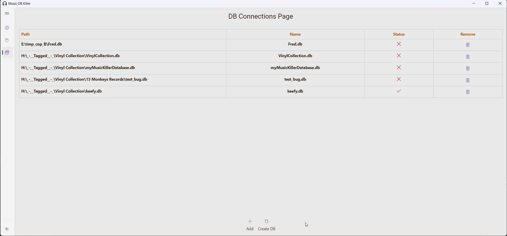
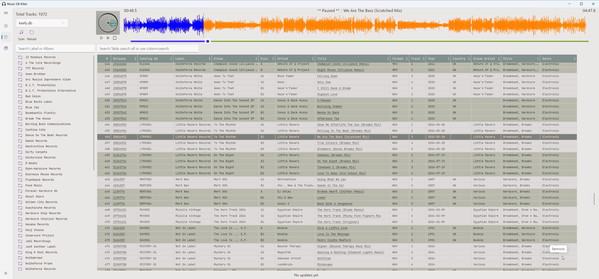
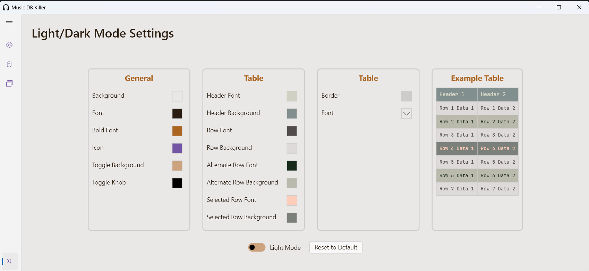

# Music Catalog Database v2 - Frontend (music-catalog-dbv2-fe)

This is the front end for my music catalog database, developed as part of a larger project to manage and organize music files based on their ID3 tags. The front end is built as a Flutter desktop app and requires a running instance of the backend (details in Part 2 below).

**Note:** This project is a work in progress, mainly created to learn Flutter. While building UIs isn't my primary focus, it's been a valuable learning experience.

---

## Project Overview

The music catalog database UI allows users to create and populate a database with music metadata extracted from ID3 tags embedded within each file. Music files lacking ID3 tags will not be added to the database. Tags can be managed through Part 1 of this project or edited via Mp3TagEditor, an excellent free MP3 tag editor.

## Key Features (In Progress)

Here are some of the features currently in development, along with a TODO list of enhancements and fixes.

### Outstanding Tasks
- **Bug Fixes:**
  - Infinite scrolling needs adjustment.
  - Streaming updates during scanning not functioning correctly.

- **UI Improvements:**
  - Optimize rendering when switching pages.
  - Allow copying data to the clipboard (single cell, row, or full table).
  - Enhance overall styling for better UX.

- **Functionality Additions:**
  - Display hyperlink addresses when hovering over the "Release ID" cell.
  - Replace "ID" column with row numbers for cleaner presentation.
  - Use icons for file types (MP3/WAV/FLAC).
  - Add a total record count summary.
  - Hide file location and hyperlink from title cells.
  - Filter tracks by file type (MP3/WAV/FLAC).
  - Show album art in the track details.
  - Add options to show/hide columns.
  - Enable column sorting and add a search bar.
  - Implement a tree view for browsing by Artist/Album/Label.
  - Display tracks in the main view when a folder is selected in the tree view.
  
- **Audio Player Enhancements:**
  - Integrate a stereo bar to load tracks and show playback progress.
  - Add playlist functionality, including play, pause, stop, and next track buttons.
  - Display a waveform view in the stereo bar, with clickable navigation.
  - Include volume control in the stereo bar.
  - Implement a database check during initialization to verify version and validity.

---

## Project Parts Overview

### Part 1: Music Catalog Management (https://github.com/okeefo/music-catalogue)

A Python and QT-based application for managing music files on the filesystem, with two primary functions:
- **Track Splitting and Tagging:** Takes a vinyl record recording file, splits it into individual tracks, and tags each track with information from Discogs (title, artist, genre, etc.).
- **File System Browser:** Features dual tree views for easy file movement and copying, with options to re tag or play files. Uses Mp3TagEditor for in-depth tag editing.

### Part 2: Backend Music Catalog Database (https://github.com/okeefo/music-catalog-dbv2-be)

A Golang and MySQL-based web service designed to handle music catalog management:
- **Database Creation and Management:** Supports multiple databases, scanning files, and populating the database.
- **APIs for Frontend Integration:** Provides endpoints for the frontend (music-catalog-dbv2-fe) to access and manage music data.

--- 

Screen Shots

---
My TODO LIST

 //TODO: Improvement - when clicking to another page - table - re-renders
 //TODO: improve styling
 //TODO: replace MP3/WAV/FLAC with icons
 //TODO: Add a filter to show only MP3/WAV/FLAC
 //TODO: the initialise method show check the version number and if the DB is valid before adding it to the list

